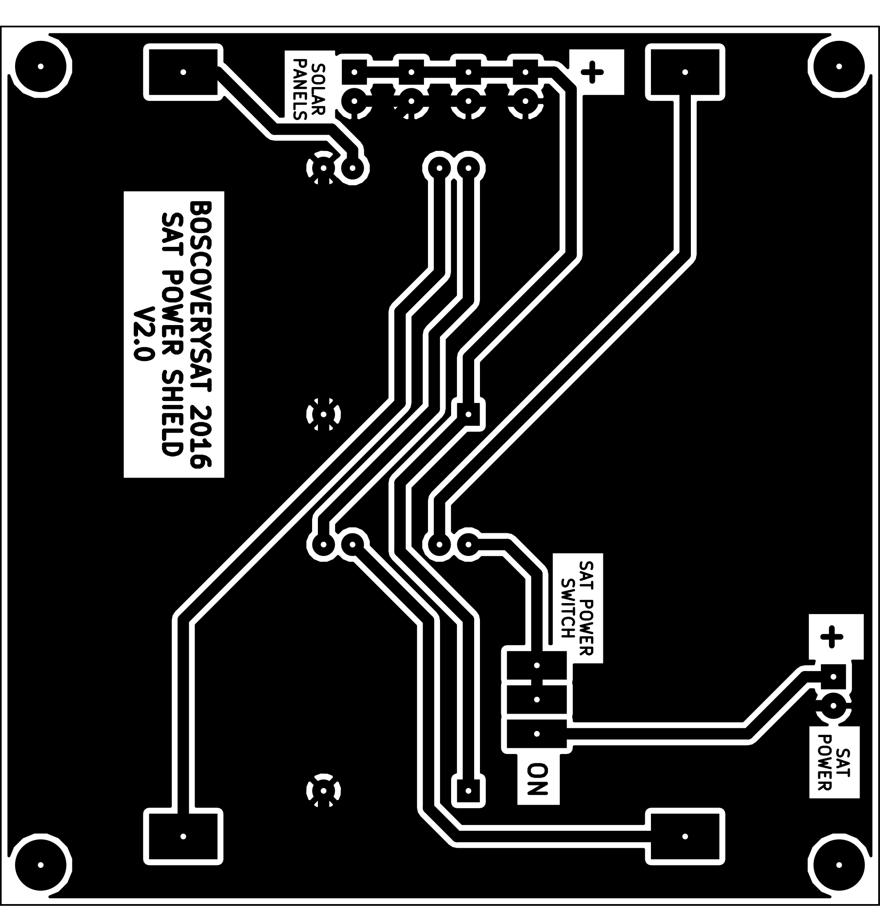

# SAT Battery Shield

## Resumen

Esta sección del repositorio contiene el circuito electrónico y el diseño de placa de circuito impreso para el sistema de alimentación del satélite.

El actual diseño electrónico se ha llevado a cabo mediante el software **KiCAD**.

## Contenido de la Shield

La PCB cuanta con unas dimensiones de 77 x 77 mm, realizada en base de fibra de vidrio y una única capa de cobre, disponiendo de cuatro orificios
de fijación, para el chasis del satélite, ubicados en las esquinas de la placa.

Actualmente, el diseño de este elemento se encuentra desarrollado para que sea capaz de alojar dos baterías recargables del tipo `18650`, por una tensión
nominal de **3,7V** y una intensidad de **5.000mAh**.

La placa tiene capacidad para conectar a ella cuatro parejas de placas solares, conectadas en serie entre ellas y posteriormente en paralelo en la propia
PCB. Esto nos permite contar con niveles de tensión de entre 8VDC y 11,50VDC, con una intensidad máxima de 50 mA, cada pareja de placas solares.

Para el sistema de recarga de baterías y alimentación de la electrónica de abordo, se han implementado dos módulos de recarga de baterías basados en
el circuito **TP4056**.

El objetivo de emplear este tipo de dispositivo era el de conectarlos en serie para poder proporcionar energía suficiente a la electrónica del satélite.

Además de lo indicado hasta el momento, la placa cuenta con un interruptor que nos permite encender y apagar el satélite de manera manual. En un futuro,
esta funcionalidad será empleada para implementar el sistema **RBF** ( *Remove Before Flight* ) así como los sistemas de conexión en el momento del
despliegue del satélite.

## Fallos detectados

Actualmente tenemos un fallo de alimentación dado que, una vez conectados los módulos `TP4056`, el segundo de ellos, al detectar un nivel de tensión
superior a los 4VDC en la salida del mismo (nivel proveniente del primer módulo que está conectado en serie con éste), deja de funcionar, proporcionando
a la salida de la placa, un nivel de tensión correspondiente al proporcionado únicamente por una de las baterías.

## Propuestas de mejora

- Rediseñar la electrónica de la placa con el objeto de implementar reguladores de tensión basados en los dispositivos **78L09** así como en el regulador de carga **MAX1873**.
- Proporcionar lineas de test para el registro del nivel de tensión proporcionado por las caras del satélite.
- Proporcionar lineas de test para el registro del nivel de tensión disponible en cada una de las baterías.

#### Diseño PCB

