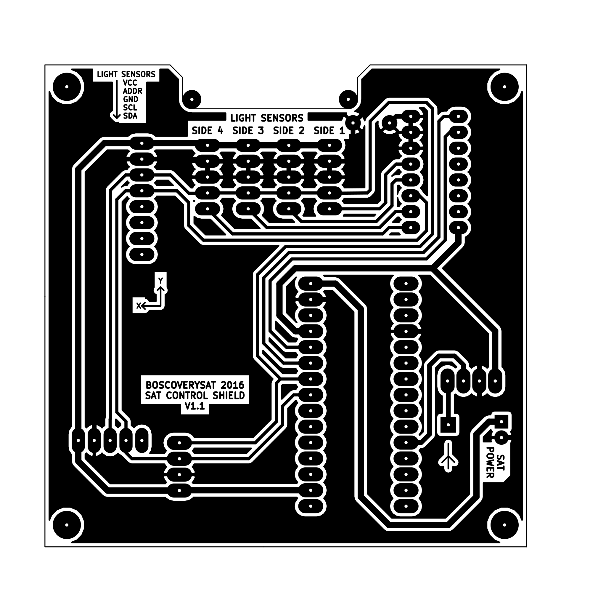

# SAT Control Shield

## Resumen

Esta sección del repositorio contiene el circuito electrónico y el diseño de placa de circuito impreso para el sistema de control del satélite.

El actual diseño electrónico se ha llevado a cabo mediante el software **KiCAD** e incluye en una misma placa, el núcleo de procesamiento del
satélite (formado por un Arduino Nano v3.0), los sensores de inercia y orientación, así como un único sensor de temperatura, los pines necesarios
para la conexión de cuatro sensores de intensidad luminosa y el módulo de transmisión RF a 433MHz.

## Contenido actual de la Shield

La PCB cuenta con unas dimensiones de 77 x 77 mm, realizada en base de fibra de vidrio y una única capa de cobre, disponiendo de cuatro orificios
de fijación, para el chasis del satélite, ubicados en las esquinas de la placa.

Actualmente la placa cuenta con una alimentación simple que proviene desde la shield de alimentación. De este modo, a la entrada de la placa disponemos
de un nivel de tensión de entre 7,5VDC y 8,4VDC, dependiendo del nivel de carga que tengan las baterías.

Con este nivel de voltaje se proporciona energía directamente a la unidad de control del satélite, formada por el Arduino Nano v3.0. A partir de él,
empleamos las salidas estabilizadas de 5VDC y 3,3VDC para alimentar al resto de elementos del circuito.

De este modo, el giroscopico (`HPU6000`), el acelerómetro (`HMC5883L`), el sensor de temperatura (`HTU21D`) y los sensores de luminosidad (`BH1750`) se
encuentran alimentados a 3,3VDC.

Por otro lado, el transmisor de RF (`CDT-88`) y el multiplexor de I2C (`74HC4052E`) se encuentran alimentados a 5VDC.

Todos los sensores presentes en la placa, se comunican con el Arduino a través del bus I2C. Por esta razón y dado que en el diseño se emplean múltiple
sensores del mismo modelo que vienen con la dirección de comunicación fijada por hardware, ha sido necesario emplear el circuito integrado `74HC4052E`,
encargado de multiplexar la señal SDA del I2C.

**NOTA:** La **multiplexación** de la señal **SDA** del bus **I2C** mediante el circuito integrado `74HC4052E` aún se encuentra en **fase experimental**.

## Fallos detectados

Aún no se han detectado fallos para el diseño actual.

## Propuestas de mejora

- Confirmar el correcto funcionamiento de la multiplexación del canal SDA del bus I2C mediante el uso del circuito integrado `74HC4052E`.
- Multiplexar la señal SDA para los sensores de intensidad luminosa.
- Multiplexar la señal SDA para los sensores de temperatura.
- Obtener lecturas de los niveles de tensión proporcionados por las placas solares dispuestas en las caras del satélite.
- Obtener lecturas de los niveles de tensión proporcionados por las baterías del sistema de alimentación.

#### Diseño PCB

